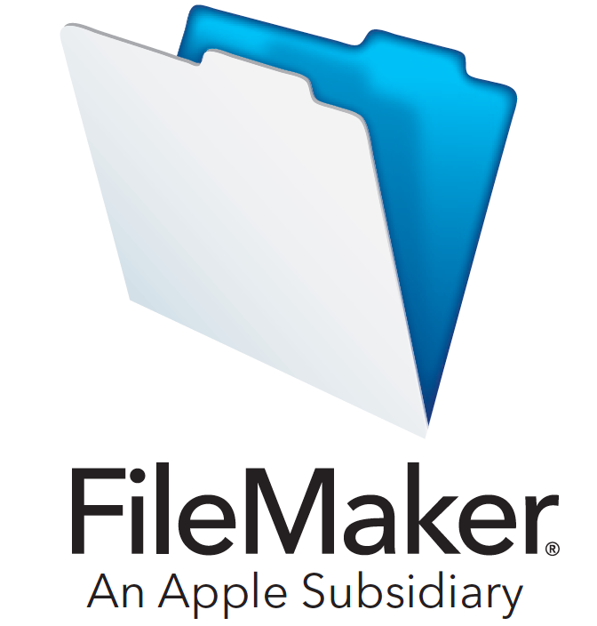
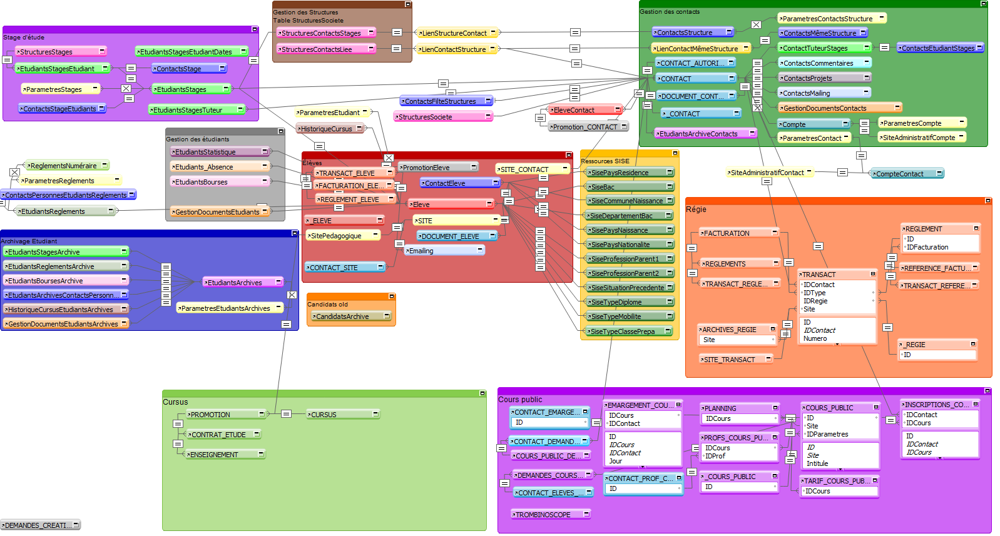

\pagebreak

# Sommaire
1.  [Liste des compétences validées]
2.  [Introduction]
    * [Résumé en anglais]
3. [Présentation de l'entreprise]
    * [Organigramme]
4. [Présentation du projet]
    * [FileMaker]
    * [Modèle conceptuel de données]
    * [Modèle physique des données]

\pagebreak

# Liste des compétences validées

\pagebreak

# Introduction
Dans le cadre de ma formation Bachelor Développeur Web à MyDigitalSchool Angers, j’ai effectué mon alternance à __[l’École supérieure d’Art et de Design TALM-Angers (ESAD-TALM)](https://esad-talm.fr/)__ pour l’année académique 2021-2022.

l’École supérieure d’Art et de Design TALM est une école supérieure publique, sous tutelle du ministère de la Culture, issue de la réunion des écoles des beaux-arts de Tours, d’Angers et du Mans.
Elle offre de nombreuses formations en art (sculpture, techniques textiles, travail de métaux), conservation-restauration, ou en design (computationnel et mécatronique, objet, sonore, territoire).
L’enseignement y est dispensé par un corps professoral qui regroupe artistes, plasticiens, photographes, architectes, chercheurs, designers, théoriciens, conservateurs-restaurateurs, etc. 
L'école accueille chaque année près de 300 élèves qui se destinent aux métiers de l’art et du design.

Ayant obtenu une licence de sciences, technologie et santé Mention Informatique à l’Université d’Angers en 2020, j’ai signé un contrat à durée déterminée avec l’ESAD-TALM en mars 2021 pour un poste de développeur informatique.
J’ai ensuite signé un contrat d’apprentissage en juin 2021 pour rejoindre MyDigitalSchool pour faire une troisième année de bachelor en Développement Web en alternance. 
Sortant d’une licence qui était principalement axée sur la théorie et les sciences dures, mes objectifs en choissisant ce parcours étaient de peaufiner mes compétences dans le développement full-stack de solutions web, développer mes softs skills et en apprendre davantage sur la gestion de projet et le management.

L’École supérieure d’Art et de Design TALM cherchait à remplacer leur logiciel de gestion administrative, pédagogique et financière nommé iMuse, edité par __[SAIGA Informatique](https://www.saiga.fr/)__, qui était utilisé partiellement ou non selon le site. L’école a donc opté pour une solution FileMaker qui serait personalisée aux besoins de l’école et qui permettrait aux trois sites de travailler sur un outil commun.
Mon travail consiste donc à concevoir et créer une base de données commune aux trois sites afin de faciliter la saisie et le partage de données, avec une interface et des outils personnalisés, sous FileMaker.

## Résumé en anglais
After completing my bachelor’s degree in sciences & technology at the Université of Angers in 2020, I sought to learn more about programming (especially in web development and networks) and about the workplace environment. 
In order to gain experience and apply for a bachelor in MyDigitalSchool, I gained a software developer position at ESAD-TALM, which is an arts & design college. 
I worked full-time from march 2021 until september 2021, by which point my contract became an internship.
ESAD-TALM was looking to replace their old database management system, called iMuse and created by SAIGA Informatique, with FileMaker, which is a cross-platform relational database application, created by Claric Inc.
My job consists in creating and managing the database, and developing user interfaces and scripts specifically tailored to the college’s needs.

# Présentation de l'entreprise

## Organigramme

# Présentation du projet

Dans le cadre de mon alternance, j'ai travaillé sur la création d'un logiciel de gestion basé sur la solution FileMaker, qui sera utilisé par les trois sites pédagogiques de l'École supérieure d'Art et de Design TALM.
Il est composé de plusieurs interfaces graphiques crées avec FileMaker permettant aux divers utilisateurs (agents pédagogiques, professeurs, élèves) de lire, créer ou modifier les enregistrements de la base de données relationnelle.
Les interfaces graphiques sont personalisées en fonction du type d'utilisateur et de son site d'appartenance.
Plusieurs scripts d'automatisation sont mis en place afin de faciliter la saisie de données pour les différents utilisateurs.

Le logiciel est divisé en plusieurs *modules*, correspondant à un usage spécifique.
Les principaux modules sont :

* Le module contact, qui est le centre névralgique du logiciel et de la base de données. Il permet de créer et de gérer des contacts (élèves, professeurs, participants cours public, candidats aux concours..)
* Le module élève, qui est une extension du module contact. Il permet de gérer toutes les informations liées aux élèves inscrits à l'école (promotion, cursus, stages, bourses, informations SISE..)
* Le module promotion, qui gère les cursus, les promotions, la génération de plusieurs documents comme
* Le module de régie, permettant d'enregistrer, modifier ou archiver des transactions et de générer plusieurs documents (factures, devis, reçus, remises..)

Pour avoir une vue d'ensemble de l'arborescence de ces différents modules, merci de vous référer au __[Modèle conceptuel de données]__, ou bien au __[Modèle physique de données]__.

\pagebreak

## FileMaker

{ width=50% }

__[FileMaker](https://www.claris.com/fr/)__ est un logiciel multi-plateformes de gestion de bases de données relationelles qui a été crée en avril 1985 par Claris International, une filiale d’Apple.
Il est composé d’un moteur de bases de données relationnelles et d’un environnement graphique.

\pagebreak

## Modèle conceptuel de données

\pagebreak

## Modèle physique de données

\pagebreak

## Maquettage

\pagebreak
